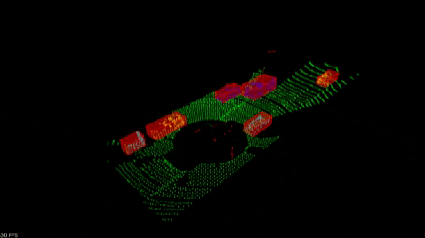
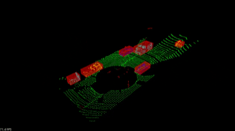
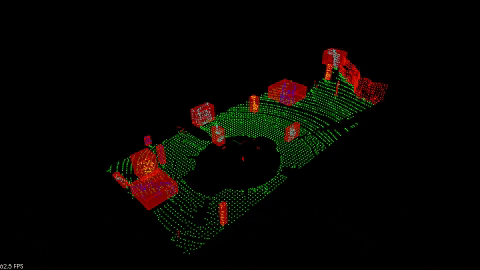

# Sensor Fusion Nanodegree: LIDAR Obstacle Detection
Part of Sensor Fusion Nanodegree at Udacity

## Description of the project structure
Within the first class, a point cloud segmentation is developed. The point cloud is segmented into plane and object cloud by calculating the point-to-plane distance and choosing the plane with lowest overall points' distances. 
The next step is to cluster the objects. For this a KdTree is implemented which selects cluster by it's euclidean distance. 
The final result is a bounding box around those detected objects.
Within the main-file environment.cpp, it is possible to activate / deactivate the rendering and calculation of those elements by changing following boolean values: 
```c++
bool render_cluster = true;
bool render_box = true;
bool render_segments = true;
bool render_filtred = false;
```
Furthermore, a series of PNG-images is created, if `bool save_png` is set to true.
Following GIF was created on the first dataset with `distance_tolerance` for clustering set to 0.53 m. 

It can be seen, that it works correctly in general, only two cars are not seperated correctly after the first was occluded and got into the view of the camera again. With `distance_tolerance` for clustering set to 0.4 m, this bug could be solved in this scene, as can be seen in the following GIF.

Following GIF shows the algorithm running on the second dataset. 

